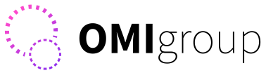

# OMI Extensions for Godot

This repository is used by the [Open Metaverse Interoperability Group](https://omigroup.org/) to develop [Godot Engine](https://godotengine.org/) implementations of [our glTF extensions](https://github.com/omigroup/gltf-extensions). These are in addition to any extensions we upstream into Godot, since not every extension should be upstreamed.

Extensions implemented in this repository:

| Extension name                 | Import | Export | Godot version | Link                                                                                                                                         |
| ------------------------------ | ------ | ------ | ------------- | -------------------------------------------------------------------------------------------------------------------------------------------- |
| **OMI_environment_sky**        | Yes    | Yes    | 4.4+          | [OMI_environment_sky extension spec](https://github.com/omigroup/gltf-extensions/tree/main/extensions/2.0/OMI_environment_sky)               |
| **OMI_materials_blend**        | Yes    | Yes    | 4.4+          | [OMI_materials_blend extension spec](https://github.com/omigroup/gltf-extensions/tree/main/extensions/2.0/OMI_materials_blend)               |
| **OMI_physics_joint**          | Yes    | Yes    | 4.4+          | [OMI_physics_joint extension spec](https://github.com/omigroup/gltf-extensions/tree/main/extensions/2.0/OMI_physics_joint)                   |
| **OMI_seat**                   | Yes    | Yes    | 4.0+          | [OMI_seat extension spec](https://github.com/omigroup/gltf-extensions/tree/main/extensions/2.0/OMI_seat)                                     |
| **OMI_spawn_point**            | Yes    | No     | 4.0+          | [OMI_spawn_point extension spec](https://github.com/omigroup/gltf-extensions/tree/main/extensions/2.0/OMI_spawn_point)                       |
| **OMI_vehicle_body**           | Yes    | Yes    | 4.3+          | [OMI_vehicle_body extension spec](https://github.com/omigroup/gltf-extensions/tree/main/extensions/2.0/OMI_vehicle_body)                     |
| **OMI_vehicle_hover_thruster** | Yes    | Yes    | 4.3+          | [OMI_vehicle_hover_thruster extension spec](https://github.com/omigroup/gltf-extensions/tree/main/extensions/2.0/OMI_vehicle_hover_thruster) |
| **OMI_vehicle_thruster**       | Yes    | Yes    | 4.3+          | [OMI_vehicle_thruster extension spec](https://github.com/omigroup/gltf-extensions/tree/main/extensions/2.0/OMI_vehicle_thruster)             |
| **OMI_vehicle_wheel**          | Yes    | Yes    | 4.3+          | [OMI_vehicle_wheel extension spec](https://github.com/omigroup/gltf-extensions/tree/main/extensions/2.0/OMI_vehicle_wheel)                   |

Extensions implemented upstream in Godot Engine:

| Extension name        | Import | Export | Godot version | Link                                                                                                                       |
| --------------------- | ------ | ------ | ------------- | -------------------------------------------------------------------------------------------------------------------------- |
| **OMI_collider**      | Yes    | Yes    | 4.1+ or 3.6+  | [OMI_collider extension spec](https://github.com/omigroup/gltf-extensions/tree/main/extensions/2.0/Archived/OMI_collider)  |
| **OMI_physics_body**  | Yes    | Yes    | 4.1+ or 3.6+  | [OMI_physics_body extension spec](https://github.com/omigroup/gltf-extensions/tree/main/extensions/2.0/OMI_physics_body)   |
| **OMI_physics_shape** | Yes    | Yes    | 4.3+          | [OMI_physics_shape extension spec](https://github.com/omigroup/gltf-extensions/tree/main/extensions/2.0/OMI_physics_shape) |
