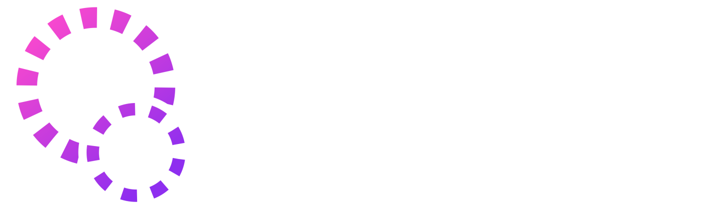

# OMI Extensions for Godot

This repository is used by the [Open Metaverse Interoperability Group](https://omigroup.org/) to develop [Godot Engine](https://godotengine.org/) implementations of [our glTF extensions](https://github.com/omigroup/gltf-extensions). These are in addition to any extensions we upstream into Godot, since not every extension should be upstreamed.

Extensions implemented in this repository:

| Extension name      | Import | Export | Godot version | Link                                                                                                                   |
| ------------------- | ------ | ------ | ------------- | ---------------------------------------------------------------------------------------------------------------------- |
| **OMI_seat**        | Yes    | Yes    | 4.0+          | [OMI_seat extension spec](https://github.com/omigroup/gltf-extensions/tree/main/extensions/2.0/OMI_seat)               |
| **OMI_spawn_point** | Yes    | No     | 4.0+          | [OMI_spawn_point extension spec](https://github.com/omigroup/gltf-extensions/tree/main/extensions/2.0/OMI_spawn_point) |

Extensions implemented upstream in Godot Engine:

| Extension name       | Import | Export | Godot version | Link                                                                                                                     |
| -------------------- | ------ | ------ | ------------- | ------------------------------------------------------------------------------------------------------------------------ |
| **OMI_collider**     | Yes    | Yes    | 4.1+          | [OMI_collider extension spec](https://github.com/omigroup/gltf-extensions/tree/main/extensions/2.0/OMI_collider)         |
| **OMI_physics_body** | Yes    | Yes    | 4.1+          | [OMI_physics_body extension spec](https://github.com/omigroup/gltf-extensions/tree/main/extensions/2.0/OMI_physics_body) |
